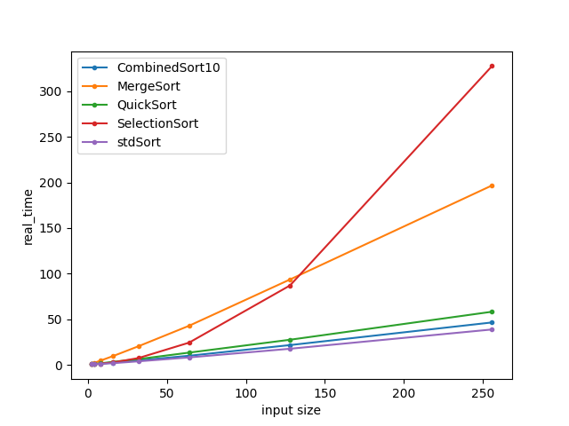
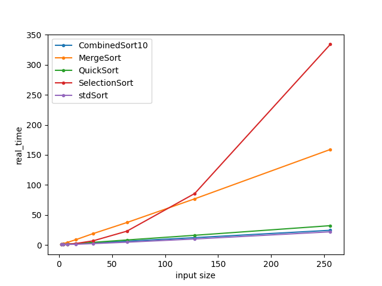
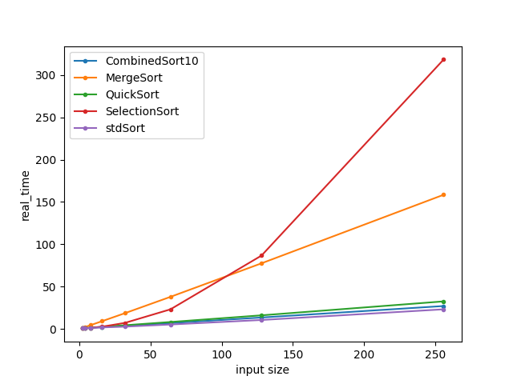

## Demo mode

To run demo mode choose **demo** as executable in your IDLE

## Benchmark mode
- To run benchmark choose **bench** target in your IDLE
- Use this program arguments to output benchmark to <file_path>
  - --benchmark_out=<file_path> --benchmark_out_format=console

- Pre-done benchmarks with graphic visualisation located in **Benchmarks** directory

## Pre-done benchmarks
- Random array sorting
- 
- Almost sorted array sorting
- 
- Almost reversed sorted array sorting
- 