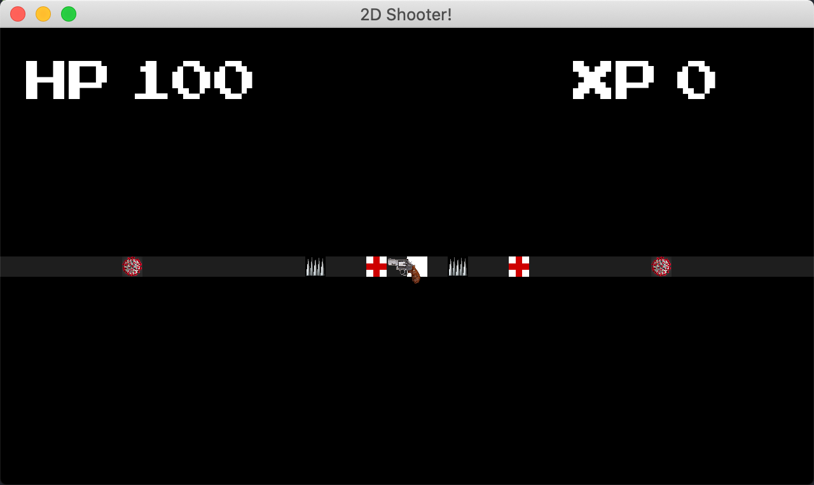

# 16: Journal
Choose target **16** in your idle to run interactive mode
### Interactive mode
```
create <name> <size>     Create journal
del <name>               Delete journal
len <name>               Get size of journal
print <name>             Print journal
push <name> <message>    Push message to journal
ls                       List journals
help                     Run help
demo                     Run demo
```
### Demo mode
- type **demo** in interactive mode to run demo

# 20: Set
Choose target **20** in your idle to run interactive mode
### Interactive mode
```
create <name>            Create set
del <name>               Delete set
len <name>               Get size of set
print <name>             Print set
insert <name> <values>   Push message to set
contains <name> <value>  Check is value in set
add <c> <a> <b>          c = a + b
sub <c> <a> <b>          c = a - b
int <c> <a> <b>          c = a | b (intersection)
xor <c> <a> <b>          c = a ^ b (exclusive or)
ls                       List sets
help                     Run help
demo                     Run demo
```
### Demo mode
- type **demo** in interactive mode to run demo

# 30: 1D Shooter
1. Download and install SFML: https://www.sfml-dev.org/download.php
2. If cmake can't find sfml with **find_package** automatically link SFML by hand
3. Choose target **30** in your idle to run 1D Shooter

- **res** directory should be **../res** relative to executable



