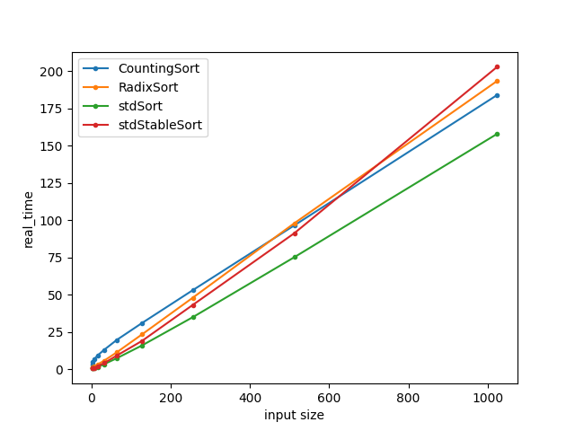
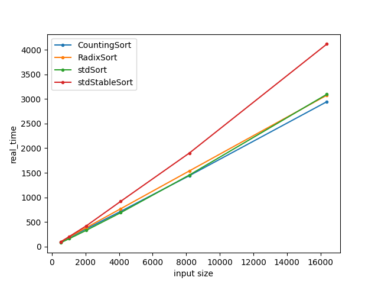

# Interactive mode

Database management:
-  **create :**    Create database
-  **deldb :**     Delete database
-  **lsdb :**      List databases
-  **add :**       Add (push) database from file
-  **load :**      Load database from file
-  **save :**      Save database to file
-  **gen :**       Generate random database
-  **search :**    Search messages and write to database

Message management:
-  **send :**      Create new message
-  **ls :**        List messages in database
-  **edit :**      Edit message
-  **del :**       Delete message

Other:
-  **help :**      Help list
-  **demo :**       Run demo
-  **exit :**      Exit from program

**type "-command_name- help" to _get command info_**

###NEW!!
-  **cprint :**     Comact print
-  **sort :**       Sort by ID or message type

## Demo mode

To run demo mode choose **demo** as executable in your IDLE

## Benchmark mode
- To run benchmark choose **bench** target in your IDLE
- Use this program arguments to output benchmark to <file_path>
  - --benchmark_out=<file_path> --benchmark_out_format=console

- Pre-done benchmarks with graphic visualisation located in **Benchmarks** directory

## Pre-done benchmarks
- Random array sorting (2 - 1024)

- Random array sorting (512 - 16384)
