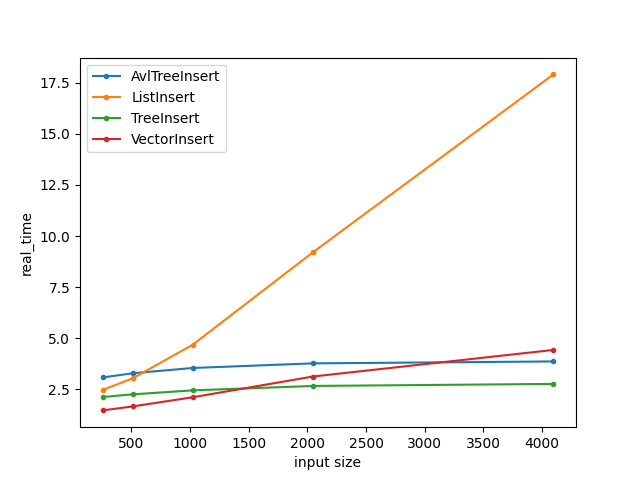
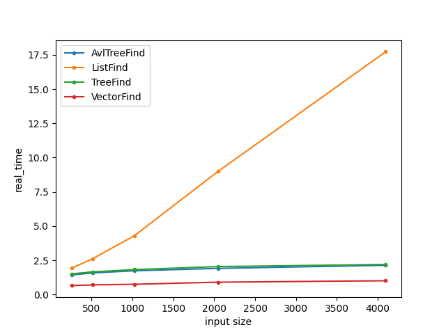
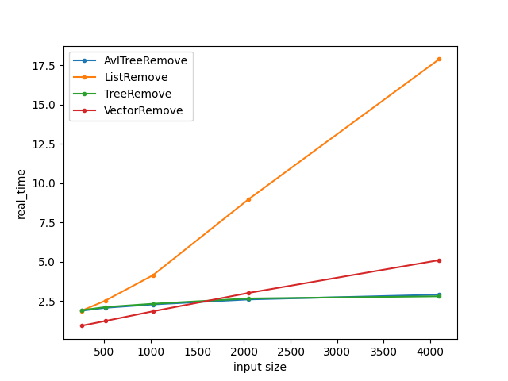
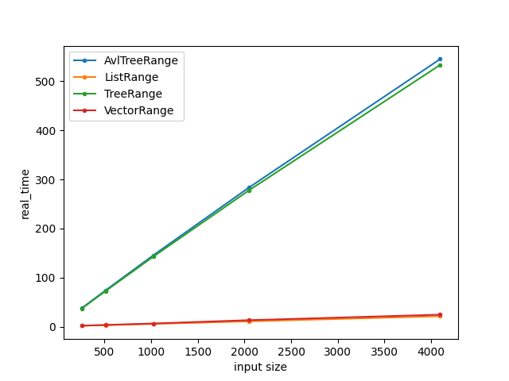

## Interactive mode
To run interactive mode choose **interactive** as executable in your IDLE
```
rand <count>             Insert <count> rand values
insert <value>           Insert value in containers
remove <value>           Remove value from containers
find <value>             Find value in containers
findr <v1> <v2>          Find value in range v1 - v2
print                    Print containers
clear                    Clear containers
help                     To get help
```

## Demo mode
- To run demo mode choose **demo** as executable in your IDLE

## Benchmark mode
- To run benchmark mode choose **bench** as executable in your IDLE
- Pre-done benchmarks located in **Benchmarks** directory





